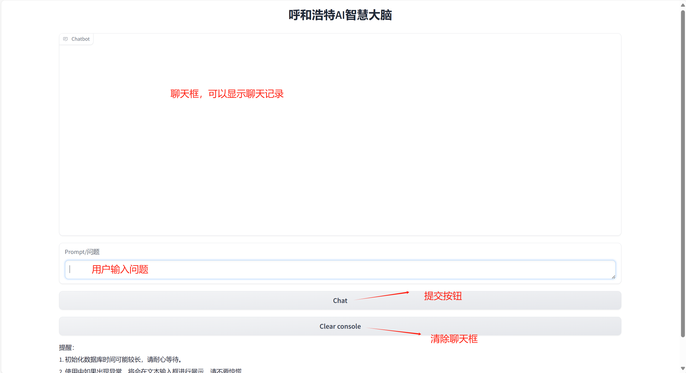
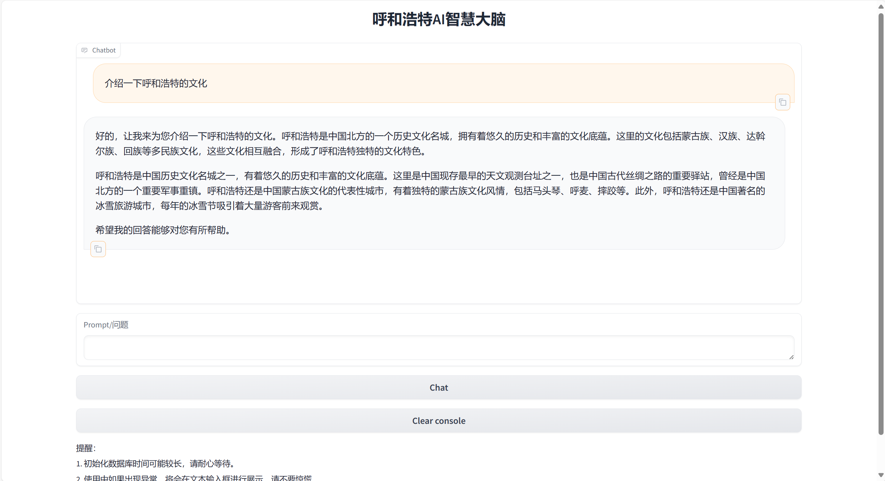

# HohhotLLM
## Urban Large Language Model for Hohhot (呼和浩特城市大模型)
国内在垂直领域大模型的研究方面已经取得了显著的进展。随着深度学习技术的不断发展和计算能力的提升，越来越多的研究者开始关注如何利用大模型来解决特定领域的问题。
本项目基于Langchain为基础，结合LLM大语言模型，并以丰富的呼和浩特城市数据为基础构建了本地问答知识库来宣传呼和浩特的城市文化。
* LangChain是一个基于大语言模型（如ChatGPT）用于构建端到端语言模型应用的Python框架。[Langchain](https://github.com/langchain-ai/langchain)    
* 经过百万规模心理咨询领域中文长文本指令与多轮共情对话数据联合指令微调的 [InternLM大语言模型](https://github.com/InternLM/InternLM)   

我们期望，**Langchain构建本地知识库** 可以帮助学术界加速大模型在特定区域文化宣传的研究与应用。本项目为 **Urban Large Language Model for Hohhot** 。
## 最近更新
- 👏🏻  2024.3.08：我们的呼和浩特城市文化大模型正式发布！！！
## 简介
   在学术界，一些研究团队开始尝试将Langchain的思想应用于本地知识库的构建。他们致力于通过构建知识图谱、整合领域专家知识等方式，建立起丰富的本地知识库，并结合大型语言模型进行问题回答。这些研究旨在提高问答系统对中文语境的理解和处理能力，使其能够更准确地回答用户的问题。清华大学自然语言处理与社会人文计算实验室使用Langchain构建了一个名为“文心一言”的聊天机器人。该机器人集成了多种NLP技术，包括文本生成、语义理解、情感分析等，能够与用户进行自然、流畅的对话，并提供各种信息和服务。本文就是基于Langchain框架构建本地的知识库并接入LLM模型来构建的一个对话问答系统
<p align="center">
    
</p>

我们选择了 [InternLM大语言模型](https://github.com/InternLM/InternLM) 作为底座大语言模型，进行了**本地知识库的接入**，旨在提升模型的针对呼和浩特地区的交流问答能力。

## 使用方法
* 克隆本项目
```bash
cd ~
git clone https://github.com/R2-xurongjian/my_HohhotLLM.git
```
* 下载模型    
本项目使用的LLM模型为复旦大学研发的InternLM（书生·浦语）大语言模型，建议手动在huggingface上下载模型也可以git下载
```
git clone https://huggingface.co/internlm/internlm2-chat-7b
```

* 创建并激活conda环境    
这里我不做具体的虚拟conda环境的创建
```
conda activate InternLM
```

* 安装Langchain相关依赖
```
pip install langchain==0.0.292
pip install gradio==4.4.0
pip install chromadb==0.4.15
pip install sentence-transformers==2.2.2
pip install unstructured==0.10.30
pip install markdown==3.3.7
```
* 下载开源词向量模型    
同时，我们需要使用到开源词向量模型 [Sentence Transformer](https://huggingface.co/sentence-transformers/paraphrase-multilingual-MiniLM-L12-v2):（我们也可以选用别的开源词向量模型来进行 Embedding，目前选用这个模型是相对    轻量、支持中文且效果较好的）

* 首先需要使用 `huggingface` 官方提供的 `huggingface-cli` 命令行工具。安装依赖:

```
pip install -U huggingface_hub
```

* 然后在根目录下新建python文件 `download.py`，填入以下代码：
```python
import os
* 运行download.py进行下载

# 下载模型
os.system('huggingface-cli download --resume-download sentence-transformers/paraphrase-multilingual-MiniLM-L12-v2 --local-dir /root/data/model/sentence-transformer')
```
* 安装运行demo所需要的依赖
```shell
# 升级pip
python -m pip install --upgrade pip

pip install modelscope==1.9.5
pip install transformers==4.35.2
pip install streamlit==1.24.0
pip install sentencepiece==0.1.99
pip install accelerate==0.24.1
```
   
* 启动服务     
本项目提供了[run_gradio.py](./run_gradio.py)作为模型的使用示例，接通过 python 命令运行，即可在本地启动知识库助手的 Web Demo，默认会在 7860 端口运行，接下来将服务器端口映射到本地端口即可访问
```
python run_gradio.py
```

## 示例
* 整体布局
<p align="center">
    
</p>  

* 样例1：介绍一下呼和浩特的文化
<p align="center">
    
</p>

* 样例2：介绍一下呼和浩特的大昭寺

<p align="center">
    
</p>

* 样例3：内蒙古大学在呼和浩特的位置

<p align="center">
    
</p>


## 声明
* 本项目使用了IntertnLM模型的权重，需要遵循其[LICENSE](https://github.com/InternLM/InternLM/blob/main/LICENSE)，因此，**本项目仅可用于您的非商业研究目的**。
* 本项目提供的对话问答模型致力于提升用户对呼和浩特区域知识的了解以及使用Langchain框架构建本地知识库的使用。本项目不保证模型输出的文本完全适合于用户，用户在使用本模型时需要承担其带来的所有风险！
* 您不得出于任何商业、军事或非法目的使用、复制、修改、合并、发布、分发、复制或创建HohhotLLM的全部或部分衍生作品。
* 您不得利用HohhotLLM模型从事任何危害国家安全和国家统一、危害社会公共利益、侵犯人身权益的行为。

## 致谢
本项目由内蒙古大学计算机学院（软件学院）徐荣建发起，得到了内蒙古大学计算机学院（软件学院）刘瑞实验室的支撑，同时致谢内蒙古大学计算机学院。

